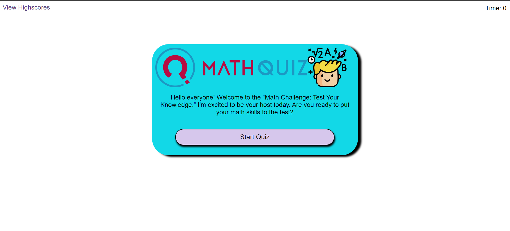

# Math Quiz Game App

    Live Link: https://quiz-game-eight-gamma.vercel.app/

## Description
This is a simple Math Quiz application developed using HTML, CSS, and JavaScript. Users can answer multiple-choice questions, receive a score at the end, and save their high scores.

 

## Features

- **Start the Game:** Click the "Start Game" button to begin the quiz.

 

- **Answer Questions:** Respond to questions by clicking on the option buttons.

 

 

- **Timer:** A timer displays how much time it took to answer the questions.

  

- **Final Score:** After answering all questions, you will see your final score and a message based on performance.

  

- **Save Score:** Enter your initials and click "Submit" to save your score and compare it with previous scores.

  

- **High Scores:** View the highest scores achieved by players.

  

  

## How to Use

1. Clone the repository to your computer.
    - Repo link: https://github.com/ramonsaguini/quizGame

2. Open the `index.html` file in a web browser.

## Contributions
Contributions are welcome! If you wish to improve this application, feel free to open an issue or submit a pull request.

## Author
Ramon Saguini de Andrade

## License
This project is licensed under the [MIT License](LICENSE).